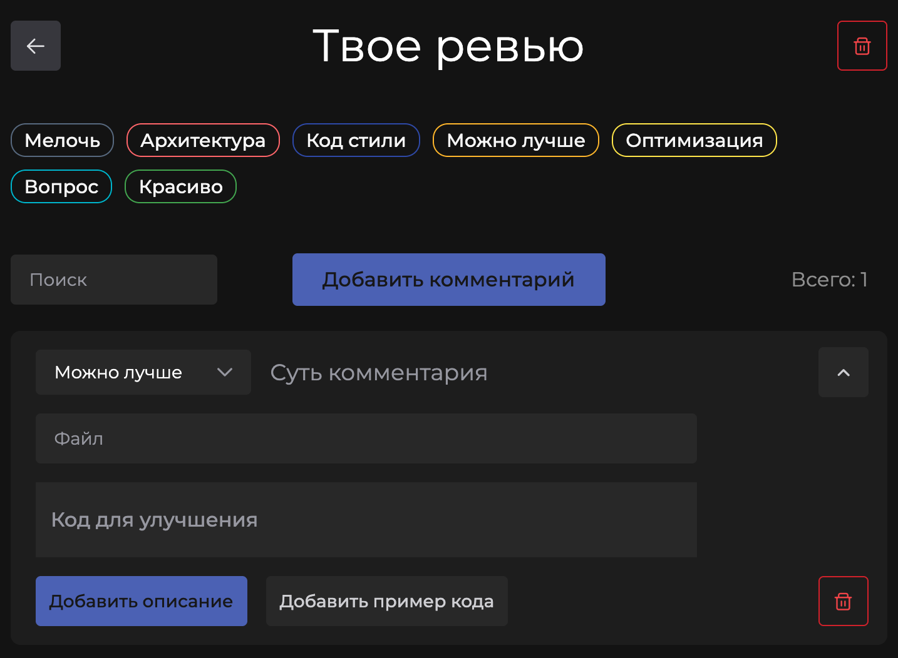

## Зачем? (проблемы гитхаба / гитлаба)

1. Для себя и проведения своих код-ревью

2. Большие ревью лагают
3. В больших ревью очень тяжело ориентироваться (как для ревьюера, так и для ревьюируемого)
- Хотелось бы фиксить проблемы от глобальных к единичным и от важных к мелочам, а обычно фиксится все по порядку комментов в гитлабе
- Хотелось бы фильтрацию и поиск по комментам

4. Иногда хочется отревьюить без мердж-реквеста - например репозиторий целиком. 

## Nice to have

- [ ] Сделать что-то, чтобы при быстром клике случайно не удалить 2 коммента

- [ ] ? Go backend для сохранения данных
- [ ] ? Режим чтения
- [ ] ? Markdown в комментарии
- [ ] ? Чекбокс выполнен ли коммент
- [ ] Тип коммента глобальный или нет
- [ ] ? Сортировка по типу комментария, дате добавления и редактирования комментария

- [ ] ? Возможность вручную задавать тему (Переключатель темы)
- [ ] ? Возможность вручную задавать доступные типы комментариев (или хотя бы вынести их в json/env)
- [ ] ? Возможность отменить удаление последнего / нескольких последних комментов
- [ ] ? Drag & Drop для смены порядка комментов

- [ ] ? Автофокус на хорошем коде / комментарии при их добавлении

- [ ] ? Улучшить респонсив
- [ ] ? Проверить, и если оно есть, то пофиксить дублирование глобальных стилей

- [ ] ? Попап подтверждения для удаления ревью
- [ ] ? Сохранение фильтрации и сортировки в урле
- [ ] ? i18n для перевода текста
- [ ] ? Более сложный поиск
